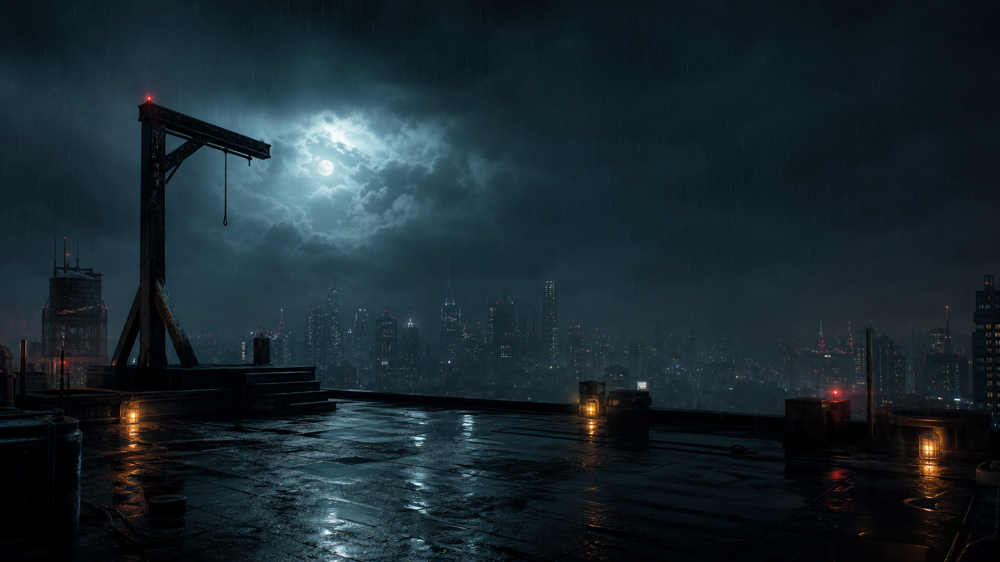

# Nightfall

> Every letter buys time.

Nightfall is a cinematic Hangman experience built with vanilla HTML, CSS, and JavaScript. Decode the hidden signal before the final attempt disappears against a rain-soaked rooftop.

[Play Nightfall](https://alan-k-biju-7.github.io/hangman/)



## What awaits you

- Three difficulty levels with distinct attempt limits and word pools
- Layered case intelligence that reveals increasingly direct clues
- A credit economy for clues and letter assists
- Keyboard and touch controls for desktop and mobile play
- Animated weather, reactive sound, and a staged threat display
- Definitions, origins, examples, and memory prompts after each case
- Persistent scores, streaks, solved cases, and win-rate statistics
- An interactive demo for first-time operatives

## Play locally

Nightfall has no build step or package dependencies. Clone the repository and serve the project directory:

```bash
git clone https://github.com/Alan-K-Biju-7/hangman.git
cd hangman
python3 -m http.server 8080
```

Open [http://localhost:8080](http://localhost:8080) in a modern browser. You can also open `index.html` directly.

## Controls

| Action | Control |
| --- | --- |
| Guess a letter | Press `A–Z` or use the on-screen keyboard |
| Request intelligence | Select **Next Clue** |
| Reveal a letter | Select **Reveal Letter** |
| Start another case | Select **New Case** |
| Close an open report | Press `Escape` |

Clues and letter assists consume credits. Solving cases earns credits based on the selected difficulty and the number of attempts remaining.

## Built with

- Semantic HTML and inline SVG artwork
- Responsive CSS with reduced-motion support
- Dependency-free JavaScript and the Web Audio API
- Canvas-based procedural rain
- Local storage for player progress

## Privacy

Progress stays in your browser. Nightfall does not collect or transmit player data.

## License

This project is available under the [MIT License](LICENSE).
